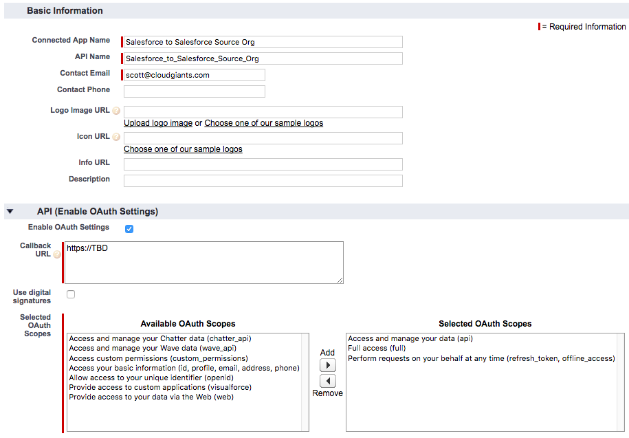
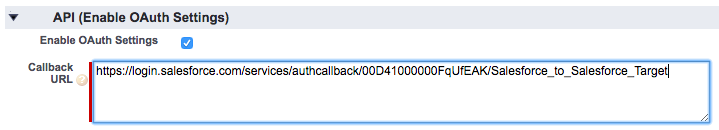

Salesforce-to-Salesforce Config

Connected App, Auth Provider, Named Credential

This document accompanies the Dreamforce 2016 session titled [Publishing Data to REST APIs with Lightning Process Builder](https://success.salesforce.com/Sessions?eventId=a1Q3000000qQOd9#/session/a2q3A000000LBSAQA4)

1. In the target org, create a Connected App to allow the source org to authenticate via OAuth 2.0

    1. Navigate to Setup -> Build -> Create -> Apps

    2. Next to "Connected Apps" click New

    3. Fill in required Basic Information fields

    4. Check the "Enable OAuth Settings" box

        1. Enter "https://TBD" for Callback URL - we will update this later

        2. Apply "Selected OAuth Scopes" as shown below

    5. Click Save

    6. Take note of the Consumer Key and Consumer Secret (treat this secret like you would a password)


2. In the source org, create an Auth Provider to allow access to the target org

    7. Navigate to Setup -> Administer -> Security Controls -> Auth Providers

    8. Next to "Auth Providers" click New

    9. Select Salesforce as the provider type, then provide a name and URL suffix

    10. Fill in the Consumer Key and Consumer Secret as noted during creation of the Connected App in the target org

    11. Authorize Endpoint URL is [https://login.salesforce.com/services/oauth2/authorize](https://login.salesforce.com/services/oauth2/authorize)

    12. Token Endpoint URL is [https://login.salesforce.com/services/oauth2/token](https://login.salesforce.com/services/oauth2/token)

    13. Default Scopes is "refresh_token full"

    14. Click "Automatically create a registration handler"

    15. Execute Registration As should be selected (pick a System Admin or similar user)

    16. Click Save

    17. Take note of the Callback URL


3. In the target org, update the Connected App

    18. Navigate to Setup -> Build -> Create -> Apps

    19. Click Edit next to your Connected App

    20. Update the Callback URL to the value noted during creation of your Auth Provider in the source org


4. In the source org, create a Named Credential to be used by your Apex code to connect to the target org

    21. Navigate to Setup -> Administer -> Security Controls -> Named Credentials

    22. Click New

    23. Provide a Label, Name, and the URL for the target org (in the example below I have enabled mydomain in the target org, so I'm using that URL)

    24. Identity Type should be Named Principal - this means regardless of which user is logged in to the source org, a single user will be used to access the target org

    25. Authentication Protocol - select OAuth 2.0

    26. Authentication Provider - select the Auth Provider you created earlier

    27. Scope - refresh_token full

    28. Start Authentication Flow on Save - checked

    29. Generate Authorization Header - checked

    30. Click Save (if you get an error here, you may need to wait a few more minutes for you last update to the Connected App in the target org to propagate and try again)

    31. At the login prompt, log in with the username and password for the target org

    32. On the Allow Access screen click Allow


    33. Log out of the target org and log back into the source org

    34. Navigate to Setup -> Administer -> Security Controls -> Named Credentials

    35. Click on your Named Credential to view the details

    36. Authentication Status	should now say "Authenticated as [your target org username]" - you are ready to reference this Named Credential in your Salesforce-to-Salesforce Apex code!

